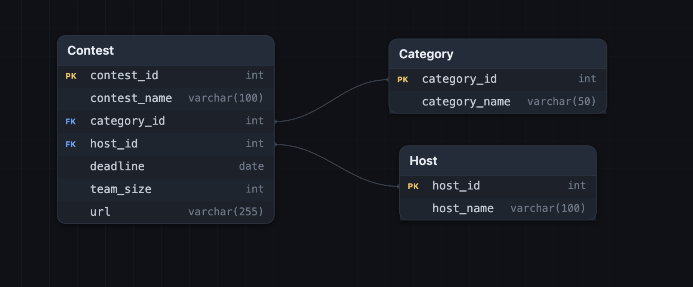

# 대회 목록 모아보기

### 핵심 기능
---
#### 1.사용자

   **-분야(Category)별 대회 검색**
      > AI, 정보보안(Security), 게임(Game), 해커톤(Hackathon) 등 원하는 분야의 대회를 빠르게 검색할 수 있습니다.
      (x)


   **-대회 정보 조회**
      > 사용자는 다음과 같은 대회 정보를 확인할 수 있습니다.
      대회명
      분야(Category)
      주최기관(Host)
      접수 마감일
      참가 가능 인원
      공식 홈페이지(URL) 등..

   


   **-북마크**
     > 관심 있는 대회를 북마크함에 추가해서
     따로 모아볼 수 있습니다


#### 2.관리자
   **-대회 글 삭제 / 추가 가능**
     > 비밀번호 입력시 글을 삭제 및 추가가 가능합니다 


### 페이지
---
1. 메인 페이지
2. 대회 추가하기
3. 관리자 로그인하기
4. 대회 디테일하게 보기
5. 북마크 페이지


### DB
---

데이터 중복을 줄이고 관리하기 쉽게 3개의 테이블로 분리하여 설계

```
Category
   │
   │
Contest
   │
   │
 Host
```
---

## Contest

| Column | Type | Key | Description |
|--------|------|-----|-------------|
| contest_id | INT | PK | 대회 고유 번호 |
| contest_name | VARCHAR(100) |  | 대회 이름 |
| category_id | INT | FK | 종목 번호 |
| host_id | INT | FK | 주최기관 번호 |
| deadline | DATE |  | 접수 마감일 |
| team_size | INT |  | 참가 가능 인원 |
| url | VARCHAR(255) |  | 공식 홈페이지 |

---

## Category

| Column | Type | Key | Description |
|--------|------|-----|-------------|
| category_id | INT | PK | 종목 고유 번호 |
| category_name | VARCHAR(50) |  | 종목 이름 |

---

## Host

| Column | Type | Key | Description |
|--------|------|-----|-------------|
| host_id | INT | PK | 주최기관 고유 번호 |
| host_name | VARCHAR(100) |  | 주최기관 이름 |

---

## 🔗 Table Relationship

| Parent Table | Child Table | Relationship |
|--------------|-------------|--------------|
| Category | Contest | Category.category_id → Contest.category_id |
| Host | Contest | Host.host_id → Contest.host_id |

---
## Category 테이블

대회의 분야(종목)를 저장하는 테이블입니다.

| 컬럼명  | 설명  |
|-------- |------|
| category_id | 종목 번호(PK) |
| category_name | 종목 이름 |

예시

|1|AI|
|2|Security|
|3|Game|
|4|Hackathon|

--------------------

## Host 테이블

대회를 주최하는 기관을 저장하는 테이블입니다.

| 컬럼명 | 설명 |
|--------|------|
| host_id | 기관 번호(PK) |
| host_name | 기관 이름 |

--------------------

## Contest 테이블

실제 대회 정보를 저장하는 핵심 테이블

| 컬럼명 | 설명 |
|--------|------|
| contest_id | 대회 번호(PK) |
| contest_name | 대회 이름 |
| category_id | 종목 번호(FK) |
| host_id | 주최기관 번호(FK) |
| deadline | 접수 마감일 |
| team_size | 참가 가능 인원 |
| url | 공식 홈페이지 |

---------------------


